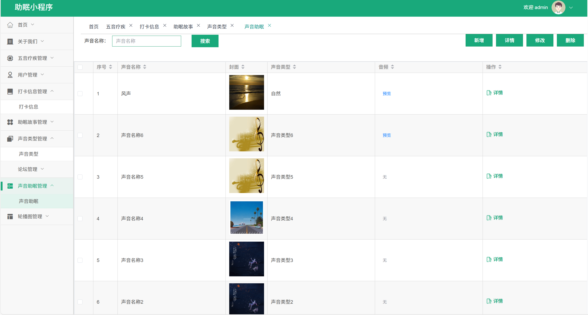

# mpweixinA096
mpweixinA096助眠微信小程序+LW+PPT（Vue3+原生）
 
## 源码问题查看主页咨询

### 一、关键词
睡眠小程序，睡眠辅助小程序，助眠微信小程序

### 二、作品包含
源码+数据库+万字设计文档+PPT+全套环境和工具资源+本地部署教程

### 三、项目技术
前端技术： Html、Css、Js、Vue3.0、Element-ui
后端技术：Java、SpringBoot2.0、MyBatis

### 四、运行环境（以下版本亲测，其他版本兼容性请自行测试）
开发工具：IDEA/eclipse  + VSCODE + 微信开发者工具

数据库：MySQL5.7（最低要5.7版本）

数据库管理工具：Navicat10以上版本

环境配置软件： JDK1.8 + Maven3.6.3

前端Nodejs：16

浏览器：谷歌浏览器

### 五、项目介绍
项目编号：mpweixinA096

研发一套助眠小程序，既能够大大提高信息的检索、变更与维护的工作效率，也能够方便微信小程序的管理运用，从而减少信息管理成本，提高效率。
该助眠小程序采用Uni-weixin、SpringBoot架构技术，前端以小程序页面呈现给用户，结合后台java语言使页面更加完善，后台使用MySQL数据库进行数据存储。该微信小程序主要设计并完成了管理过程中的用户注册登录、个人信息修改、打卡信息、助眠故事等管理功能。该微信小程序操作简便，界面设计简洁，不但可以基本满足本行业的日常管理工作，同时又可以有效减少人员成本和时间成本，为助眠管理工作提供了方便。

### 六、运行截图

